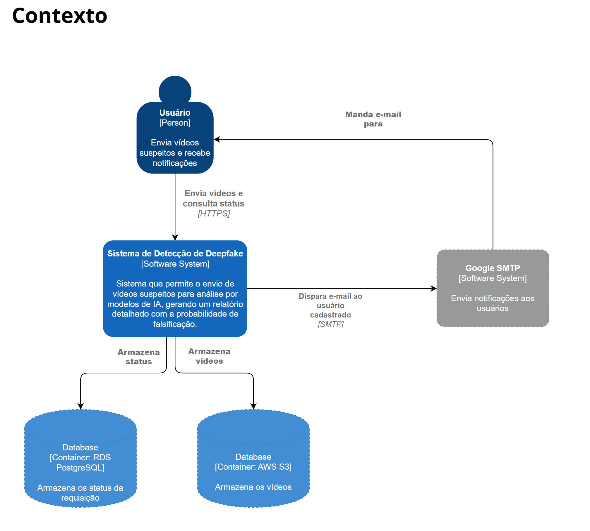

# Padrões de Arquitetura de Software - Verão

## Detecção de Vídeos Gerados por Modelos GAN

* Slides - Apresentação Inicial: <https://docs.google.com/presentation/d/1DgzvqjwAH4gJurORHiInOSs1ZNeVvWo6Hj6tNCSmbZo/edit#slide=id.p>
* Slides - Apresentação Final: <https://docs.google.com/presentation/d/1l681xqFNXYUYbuaARVSSAkbOzyb987tmTuEmViFGTLM/edit#slide=id.p>
  
## C4 Model

### 1. Context

    

### 2. Containers

    

### 3. Components

    

### 4. Code

    

    

